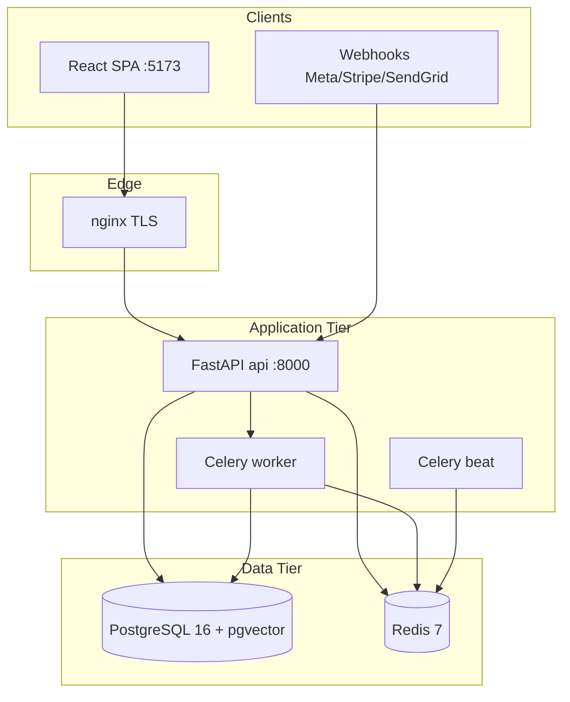

# Phase 1 — Architecture

> **Snapshot of 2026-08-18.** Flag states and several findings have changed since;
> see [`README.md`](README.md) for the verified delta as of 2026-08-20.


## 1. System Context



Evidence: `docker-compose.yml:5-342`, `CLAUDE.md:10-16`.

## 2. Request Lifecycle

Execution order (outermost → innermost), from `backend/app/main.py:383-449`:

1. **CORS** — outermost; ensures 401 responses carry CORS headers
2. **Timing / request-id** — `X-Request-ID`, structured log
3. **SecurityHeadersMiddleware** — CSP, HSTS (prod), OWASP headers
4. **AuditMiddleware** — mutating requests
5. **TenantMiddleware** — JWT decode, revocation check, tenant_id on `request.state`
6. **CSRFMiddleware**
7. **RateLimitMiddleware** — 100 req/min default
8. **GZipMiddleware**
9. **Router** — `/api/v1/*`

Prometheus HTTP metrics via `prometheus-fastapi-instrumentator` at app creation (`main.py:311-317`).

## 3. Trust Engine (Core Domain)

```
Signal Health → Trust Gate → Autopilot Decision
```

| Component | Path | Role |
|-----------|------|------|
| Signal health scoring | `analytics/logic/signal_health.py` | Weighted composite 0–100 |
| Trust gate | `stratum/core/trust_gate.py` | PASS/HOLD/BLOCK |
| Enforcer | `autopilot/enforcer.py` | Executes or blocks actions |
| Service | `autopilot/service.py` | Queue, lifecycle, recommendations |

Trust gate thresholds (defaults):

```44:46:backend/app/stratum/core/trust_gate.py
    pass_threshold: float = 70.0  # Signal health >= 70 allows execution
    hold_threshold: float = 40.0  # Signal health 40-69 holds for review
    # Below 40 = BLOCK
```

Configurable per tenant via `TrustGateConfig.from_tenant_settings()` (`trust_gate.py:79+`).

## 4. Multi-Tenancy Model

- **Application layer:** `TenantMiddleware` sets `request.state.tenant_id` from JWT / `X-Tenant-ID` / subdomain (`middleware/tenant.py:54-64`).
- **Database layer:** Row-Level Security migrations (`20260120_000000_032_add_row_level_security.py`, `034_add_rls_coverage_gaps.py`).
- **Superadmin bypass:** audited via `tenancy/deps.py` (referenced in `tenancy/__init__.py:8`).

Public endpoints exempt from tenant auth listed in `middleware/tenant.py:25-51`.

## 5. Async / Background Processing

| Component | Technology | Evidence |
|-----------|------------|----------|
| Task queue | Celery 5.6 + Redis broker | `docker-compose.yml:208-292` |
| Scheduler | Celery beat + redbeat | `requirements.txt:33` |
| Beat-gated features | Config flags default OFF | `config.py:432-457` |

Shelved beat tasks (competitor intel, automation rules, campaign builder beat, newsletter beat, drip campaigns) documented in `config.py:426-457`.

## 6. Real-Time Channels

| Channel | Path | Auth |
|---------|------|------|
| SSE (authenticated) | `/api/v1/events/stream` | Bearer via TenantMiddleware | `main.py:819-828` |
| SSE (public demo) | `/public/events/stream` | None | `main.py:756-761` |
| WebSocket | `/ws` | Optional `token` query param | `main.py:873-877` |
| Redis pub/sub | `events:tenant:{id}` | Tenant-scoped channel | `main.py:839-840` |

## 7. Feature Surface vs Launch Scope

Several routers registered but feature-gated to 503 or beat-disabled:

| Feature | Gate | Evidence |
|---------|------|----------|
| Competitor intel | `feature_competitor_intel=False` | `config.py:432` |
| Automation rules | `feature_automation_rules=False` | `config.py:434` |
| Knowledge graph | `feature_knowledge_graph=False` | `config.py:440` |
| Drip campaigns | `feature_drip_campaigns=False` | `config.py:452` |
| Campaign publish | `enable_campaign_publish=False` | `config.py:457` |

## 8. Architecture Findings

| ID | Sev | Title |
|----|-----|-------|
| F-003 | P1 | WebSocket accepts auth token in query string |
| F-014 | P2 | Campaign publish path disabled; draft CRUD without platform sync |

## 9. Positive Controls

- Clear middleware ordering with documented rationale (`main.py:383-388`)
- Trust gate never auto-executes below healthy threshold (domain docs + tests in `test_stratum_trust_gate.py`)
- Feature flags prevent half-built workers from running in prod (`config.py:426-457`)
- Readiness probe checks DB + Redis, excludes SendGrid (`main.py:62-91`)

## 10. Searches Run

```
grep "include_router" backend/app/api/v1/__init__.py  → 67 matches
glob backend/migrations/versions/*.py                 → 64 files
glob backend/tests/**/*.py                            → 318 files
```
