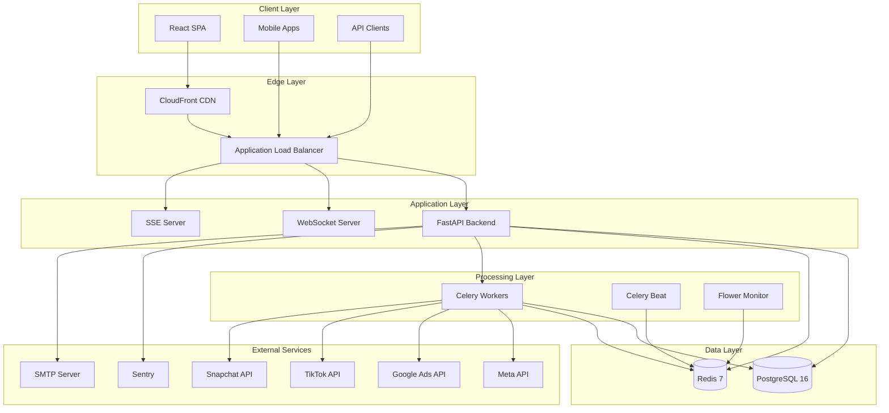
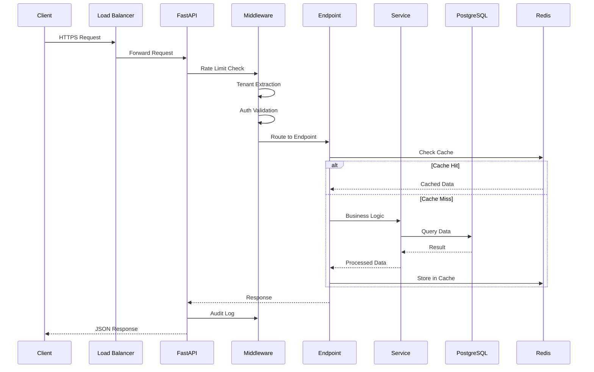
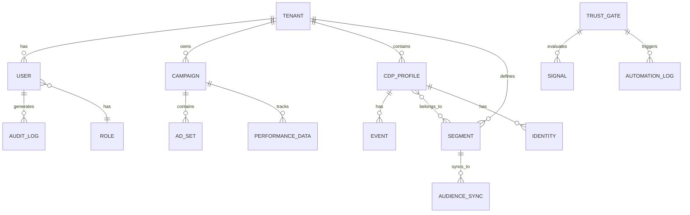
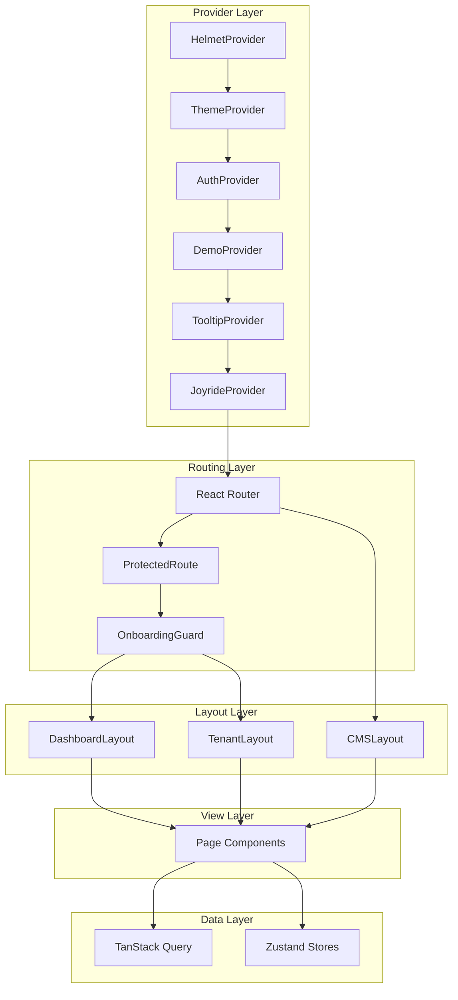
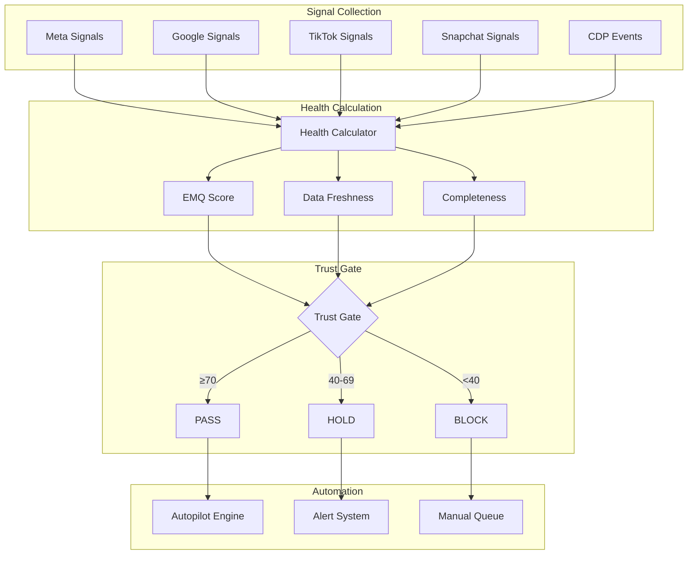
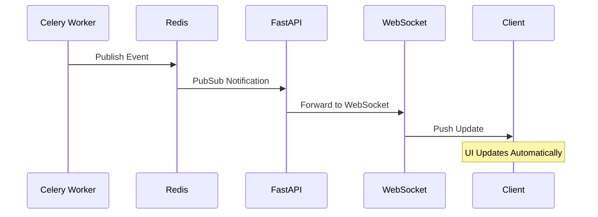
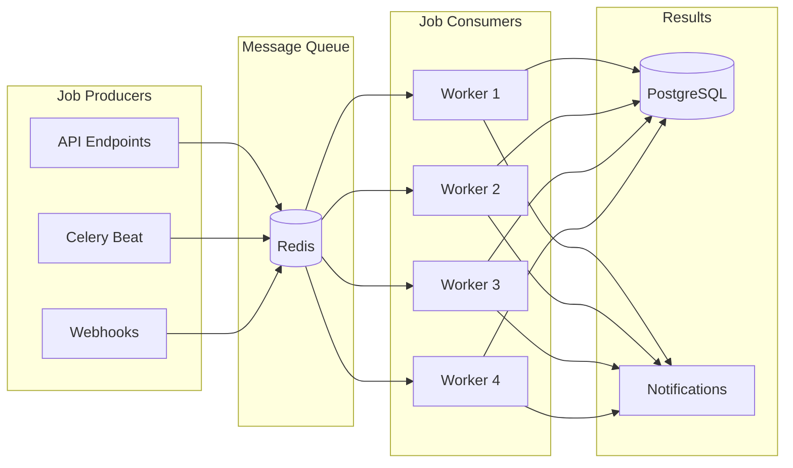
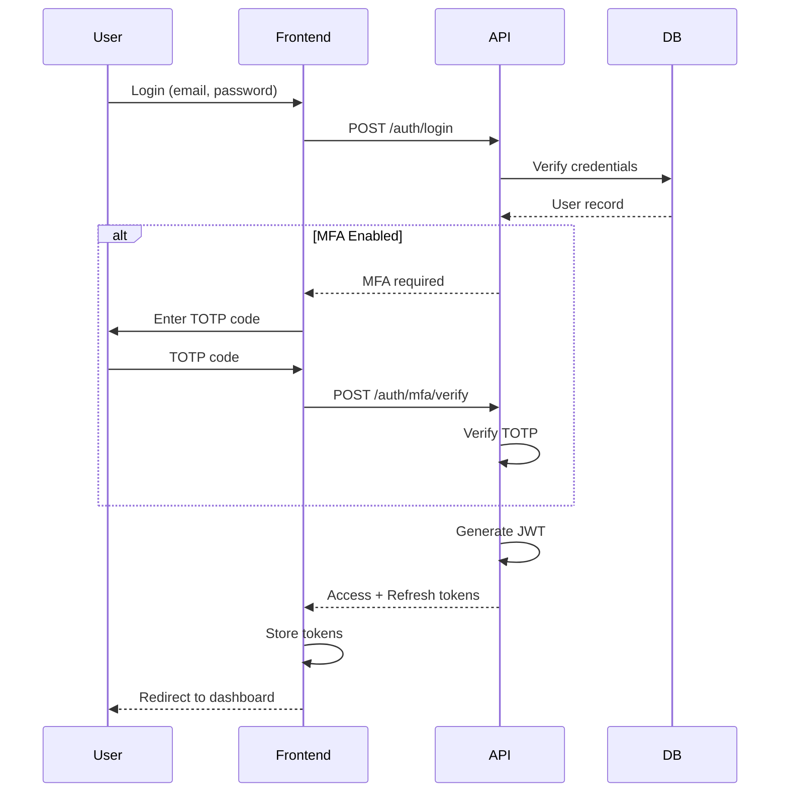
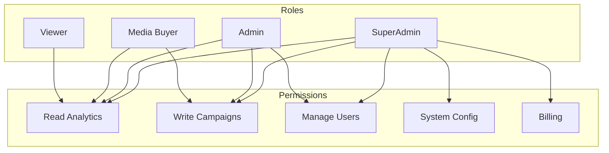
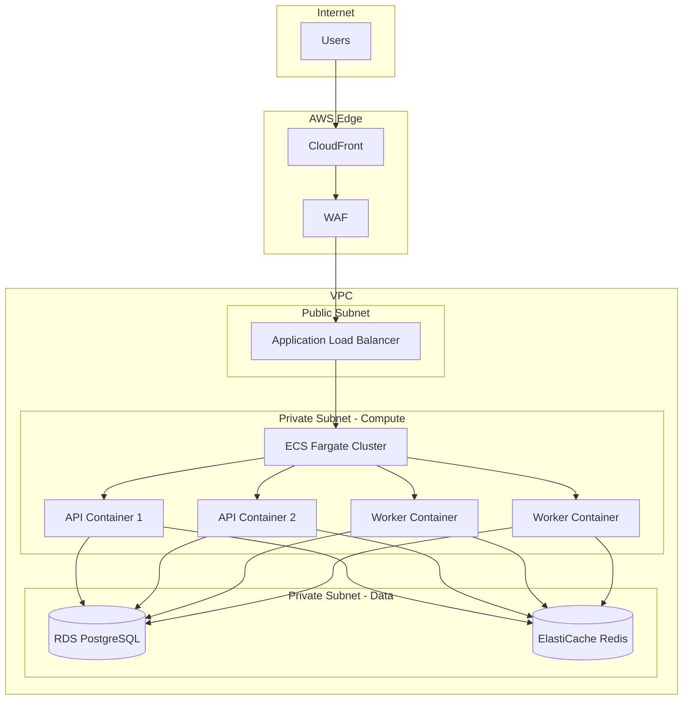

# Stratum AI - System Architecture

## High-Level Architecture



## Technology Stack

### Backend
| Component | Technology | Version | Purpose |
|-----------|------------|---------|---------|
| Framework | FastAPI | Latest | REST API, async support |
| Language | Python | 3.11+ | Type hints, performance |
| ORM | SQLAlchemy | 2.x | Database operations |
| Validation | Pydantic | 2.x | Request/response schemas |
| Task Queue | Celery | 5.x | Background jobs |
| Scheduler | Celery Beat | 5.x | Scheduled tasks |

### Frontend
| Component | Technology | Version | Purpose |
|-----------|------------|---------|---------|
| Framework | React | 18.x | UI components |
| Language | TypeScript | 5.x | Type safety |
| Styling | Tailwind CSS | 3.x | Utility-first CSS |
| State | Zustand | Latest | Global state management |
| Data Fetching | TanStack Query | 5.x | Server state management |
| Build Tool | Vite | 5.x | Fast bundling |

### Infrastructure
| Component | Technology | Purpose |
|-----------|------------|---------|
| Database | PostgreSQL 16 | Primary data store |
| Cache | Redis 7 | Caching, message broker |
| Container | Docker | Containerization |
| Orchestration | Docker Compose | Local development |
| Cloud | AWS (ECS, RDS, ElastiCache) | Production hosting |

### Observability
| Component | Technology | Purpose |
|-----------|------------|---------|
| Metrics | Prometheus | Metric collection |
| Visualization | Grafana | Dashboards |
| Error Tracking | Sentry | Error monitoring |
| Logging | Structlog | Structured logging |

---

## Backend Architecture

### Project Structure

```
backend/
├── app/
│   ├── main.py              # FastAPI application entry point
│   ├── core/
│   │   ├── config.py        # Settings management (Pydantic)
│   │   ├── logging.py       # Structured logging setup
│   │   ├── metrics.py       # Prometheus metrics
│   │   └── websocket.py     # WebSocket manager
│   ├── api/
│   │   └── v1/
│   │       ├── __init__.py  # API router aggregation
│   │       └── endpoints/   # 51+ endpoint modules
│   ├── auth/
│   │   ├── jwt.py           # JWT token handling
│   │   ├── mfa.py           # Multi-factor authentication
│   │   └── permissions.py   # RBAC implementation
│   ├── db/
│   │   ├── session.py       # Database connection
│   │   └── base.py          # SQLAlchemy base
│   ├── models/              # SQLAlchemy models
│   ├── schemas/             # Pydantic schemas
│   ├── services/            # Business logic
│   │   ├── cdp/             # Customer Data Platform
│   │   ├── trust_engine/    # Trust gate logic
│   │   └── integrations/    # External APIs
│   ├── workers/
│   │   ├── celery_app.py    # Celery configuration
│   │   └── tasks/           # Background tasks
│   └── middleware/
│       ├── audit.py         # Audit logging
│       ├── tenant.py        # Tenant extraction
│       └── rate_limit.py    # Rate limiting
├── alembic/                 # Database migrations
├── tests/                   # Test suite
└── Dockerfile               # Container definition
```

### Request Flow



### Middleware Stack

Middleware executes in reverse order (last added = first executed):

1. **Request Timing** - Adds timing headers and request ID
2. **Audit Middleware** - Logs state-changing requests
3. **Tenant Middleware** - Extracts tenant context
4. **Rate Limit Middleware** - Request throttling
5. **GZip Middleware** - Response compression
6. **CORS Middleware** - Cross-origin handling

### Database Schema



---

## Frontend Architecture

### Project Structure

```
frontend/
├── src/
│   ├── App.tsx              # Root component with routing
│   ├── main.tsx             # Application entry point
│   ├── api/                 # API hooks (30+ files)
│   │   ├── auth.ts          # Authentication
│   │   ├── campaigns.ts     # Campaign management
│   │   ├── cdp.ts           # CDP operations (60+ hooks)
│   │   └── ...
│   ├── components/          # Reusable components
│   │   ├── ui/              # Base UI components
│   │   ├── common/          # Shared components
│   │   ├── cdp/             # CDP-specific components
│   │   └── charts/          # Visualization components
│   ├── views/               # Page components
│   │   ├── dashboard/       # Dashboard views
│   │   ├── cdp/             # CDP views
│   │   ├── tenant/          # Tenant-scoped views
│   │   └── superadmin/      # Admin views
│   ├── contexts/            # React contexts
│   │   ├── AuthContext.tsx  # Authentication state
│   │   ├── ThemeContext.tsx # Theme management
│   │   └── DemoContext.tsx  # Demo mode
│   ├── hooks/               # Custom hooks
│   ├── lib/                 # Utilities
│   └── stores/              # Zustand stores
├── public/                  # Static assets
├── index.html               # HTML template
├── vite.config.ts           # Vite configuration
├── tailwind.config.js       # Tailwind configuration
└── package.json             # Dependencies
```

### Component Architecture



### State Management

| Type | Technology | Use Case |
|------|------------|----------|
| Server State | TanStack Query | API data caching |
| Global State | Zustand | User preferences, UI state |
| Context State | React Context | Auth, Theme, Demo mode |
| Local State | useState/useReducer | Component-specific state |

---

## Trust Engine Architecture



### Trust Thresholds

```python
# From config
HEALTHY_THRESHOLD = 70      # Green - autopilot enabled
DEGRADED_THRESHOLD = 40     # Yellow - alert + hold
# Below 40 = Red - manual required
```

---

## Data Flow Architecture

### Real-Time Updates



### Background Job Processing



---

## Security Architecture

### Authentication Flow



### Authorization Model



---

## Deployment Architecture

### AWS Production



### Docker Compose (Development)

| Service | Port | Purpose |
|---------|------|---------|
| api | 8000 | FastAPI backend |
| frontend | 5173 | Vite dev server |
| db | 5432 | PostgreSQL |
| redis | 6379 | Cache & broker |
| worker | - | Celery worker |
| scheduler | - | Celery beat |
| flower | 5555 | Celery monitoring |
