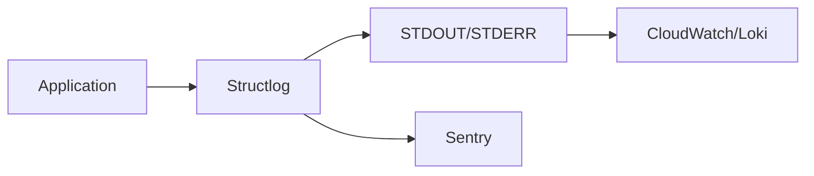

# Error Handling & Logging

## Overview

Stratum AI uses structured logging with Structlog and error tracking with Sentry.

---

## Logging Architecture



---

## Structured Logging

### Configuration

```python
# app/core/logging.py

import structlog

def setup_logging():
    structlog.configure(
        processors=[
            structlog.stdlib.filter_by_level,
            structlog.stdlib.add_logger_name,
            structlog.stdlib.add_log_level,
            structlog.stdlib.PositionalArgumentsFormatter(),
            structlog.processors.TimeStamper(fmt="iso"),
            structlog.processors.StackInfoRenderer(),
            structlog.processors.format_exc_info,
            structlog.processors.UnicodeDecoder(),
            structlog.processors.JSONRenderer(),  # JSON output
        ],
        context_class=dict,
        logger_factory=structlog.stdlib.LoggerFactory(),
        cache_logger_on_first_use=True,
    )
```

### Getting a Logger

```python
from app.core.logging import get_logger

logger = get_logger(__name__)
```

### Log Levels

| Level | Usage |
|-------|-------|
| `DEBUG` | Detailed debugging info |
| `INFO` | General operational events |
| `WARNING` | Non-critical issues |
| `ERROR` | Errors requiring attention |
| `CRITICAL` | System failures |

---

## Logging Patterns

### Basic Logging

```python
# Simple log
logger.info("User logged in", user_id=123)

# With additional context
logger.info(
    "Campaign synced",
    campaign_id=456,
    platform="meta",
    records_updated=50,
)
```

### Output Format (JSON)

```json
{
  "event": "Campaign synced",
  "campaign_id": 456,
  "platform": "meta",
  "records_updated": 50,
  "logger": "app.services.sync",
  "level": "info",
  "timestamp": "2024-01-15T10:30:00.000Z"
}
```

### Request Logging

```python
# Middleware automatically logs requests
logger.info(
    "request_completed",
    method="GET",
    path="/api/v1/campaigns",
    status_code=200,
    duration_ms=45.23,
    request_id="abc-123",
)
```

### Error Logging

```python
try:
    result = process_data()
except ValueError as e:
    logger.error(
        "Data processing failed",
        error=str(e),
        error_type=type(e).__name__,
        input_data=data,
    )
    raise

# With full exception info
except Exception:
    logger.exception("Unexpected error", context={"key": "value"})
```

---

## Context Binding

### Request Context

```python
import structlog

# Bind context for the request
structlog.contextvars.bind_contextvars(
    request_id=request_id,
    tenant_id=tenant_id,
    user_id=user_id,
)

# All subsequent logs include this context
logger.info("Processing request")  # Includes request_id, tenant_id, user_id
```

### Clear Context

```python
# At end of request
structlog.contextvars.clear_contextvars()
```

---

## Error Handling

### Global Exception Handler

```python
# app/main.py

@app.exception_handler(Exception)
async def global_exception_handler(request: Request, exc: Exception):
    logger.error(
        "unhandled_exception",
        error=str(exc),
        error_type=type(exc).__name__,
        path=request.url.path,
        method=request.method,
    )

    # Capture in Sentry
    if settings.sentry_dsn:
        sentry_sdk.capture_exception(exc)

    # Development: Full traceback
    if settings.is_development:
        return JSONResponse(
            status_code=500,
            content={
                "success": False,
                "error": str(exc),
                "error_type": type(exc).__name__,
                "traceback": traceback.format_exc(),
            },
        )

    # Production: Generic message
    return JSONResponse(
        status_code=500,
        content={
            "success": False,
            "error": "An unexpected error occurred",
        },
    )
```

### HTTP Exceptions

```python
from fastapi import HTTPException, status

# 400 Bad Request
raise HTTPException(
    status_code=status.HTTP_400_BAD_REQUEST,
    detail="Invalid input data"
)

# 401 Unauthorized
raise HTTPException(
    status_code=status.HTTP_401_UNAUTHORIZED,
    detail="Invalid credentials",
    headers={"WWW-Authenticate": "Bearer"},
)

# 403 Forbidden
raise HTTPException(
    status_code=status.HTTP_403_FORBIDDEN,
    detail="Insufficient permissions"
)

# 404 Not Found
raise HTTPException(
    status_code=status.HTTP_404_NOT_FOUND,
    detail="Resource not found"
)

# 409 Conflict
raise HTTPException(
    status_code=status.HTTP_409_CONFLICT,
    detail="Resource already exists"
)

# 422 Validation Error
# Automatically raised by Pydantic validation
```

### Custom Exceptions

```python
# app/core/exceptions.py

class StratumException(Exception):
    """Base exception for Stratum AI."""
    def __init__(self, message: str, code: str = None):
        self.message = message
        self.code = code
        super().__init__(message)

class TrustGateException(StratumException):
    """Trust gate blocked automation."""
    pass

class SignalHealthException(StratumException):
    """Signal health check failed."""
    pass

class IntegrationException(StratumException):
    """External integration error."""
    pass
```

### Exception Handler Registration

```python
@app.exception_handler(TrustGateException)
async def trust_gate_handler(request: Request, exc: TrustGateException):
    return JSONResponse(
        status_code=403,
        content={
            "success": False,
            "error": exc.message,
            "code": "TRUST_GATE_BLOCKED",
        },
    )
```

---

## Sentry Integration

### Configuration

```python
# app/main.py

if settings.sentry_dsn:
    sentry_sdk.init(
        dsn=settings.sentry_dsn,
        environment=settings.app_env,
        release="stratum-backend@1.0.0",

        # Performance monitoring
        traces_sample_rate=0.1 if settings.is_production else 1.0,
        profiles_sample_rate=0.1 if settings.is_production else 0.0,

        # PII protection
        send_default_pii=False,

        # Filter health checks
        traces_sampler=lambda ctx: 0.0 if is_health_check(ctx) else None,
    )
```

### Manual Capture

```python
import sentry_sdk

# Capture exception
try:
    process()
except Exception as e:
    sentry_sdk.capture_exception(e)

# Capture message
sentry_sdk.capture_message("Something happened", level="warning")

# Add context
with sentry_sdk.push_scope() as scope:
    scope.set_tag("platform", "meta")
    scope.set_context("request", {"url": request.url})
    sentry_sdk.capture_exception(e)
```

### User Context

```python
sentry_sdk.set_user({
    "id": user.id,
    "email": user.email,  # Only if PII enabled
    "tenant_id": user.tenant_id,
})
```

---

## Audit Logging

### Audit Middleware

```python
# app/middleware/audit.py

class AuditMiddleware:
    async def dispatch(self, request: Request, call_next):
        response = await call_next(request)

        # Log state-changing requests
        if request.method in ("POST", "PUT", "PATCH", "DELETE"):
            await self.log_audit(request, response)

        return response

    async def log_audit(self, request: Request, response: Response):
        AuditLog.create(
            tenant_id=request.state.tenant_id,
            user_id=request.state.user_id,
            action=request.method.lower(),
            resource_type=extract_resource_type(request.url.path),
            resource_id=extract_resource_id(request.url.path),
            ip_address=request.client.host,
            user_agent=request.headers.get("user-agent"),
            request_id=request.state.request_id,
        )
```

### Audit Log Model

```python
class AuditLog(Base):
    id: int
    tenant_id: int
    user_id: int

    action: str          # create, update, delete, login, export
    resource_type: str   # campaign, user, rule
    resource_id: str

    old_values: dict     # JSONB
    new_values: dict     # JSONB
    metadata: dict       # Additional context

    ip_address: str
    user_agent: str
    request_id: str

    created_at: datetime
```

---

## Log Configuration

### Environment Variables

| Variable | Default | Description |
|----------|---------|-------------|
| `LOG_LEVEL` | INFO | Minimum log level |
| `LOG_FORMAT` | json | Output format: `json` or `console` |
| `SENTRY_DSN` | - | Sentry DSN for error tracking |

### Development Mode

```python
# Console-friendly output
LOG_FORMAT=console
LOG_LEVEL=DEBUG
```

Output:
```
2024-01-15 10:30:00 [info] Campaign synced  campaign_id=456 platform=meta
```

### Production Mode

```python
# JSON output for log aggregation
LOG_FORMAT=json
LOG_LEVEL=INFO
```

Output:
```json
{"event":"Campaign synced","campaign_id":456,"platform":"meta","timestamp":"2024-01-15T10:30:00Z","level":"info"}
```

---

## Best Practices

### 1. Use Structured Logging

```python
# Bad
logger.info(f"User {user_id} logged in from {ip}")

# Good
logger.info("User logged in", user_id=user_id, ip=ip)
```

### 2. Include Context

```python
logger.error(
    "Payment failed",
    user_id=user.id,
    tenant_id=tenant_id,
    amount=amount,
    error=str(e),
    payment_provider="stripe",
)
```

### 3. Don't Log Sensitive Data

```python
# Bad
logger.info("User logged in", password=password)

# Good
logger.info("User logged in", email_hash=hash(email))
```

### 4. Use Appropriate Log Levels

```python
# DEBUG: Detailed trace
logger.debug("Processing item", item_id=i, total=len(items))

# INFO: Normal operations
logger.info("Batch processing complete", processed=100)

# WARNING: Non-critical issues
logger.warning("Deprecated API called", endpoint="/v1/old")

# ERROR: Failures requiring attention
logger.error("Database connection failed", error=str(e))

# CRITICAL: System failures
logger.critical("All workers down", active_workers=0)
```

### 5. Error Recovery Logging

```python
try:
    result = process()
except RecoverableError as e:
    logger.warning("Recoverable error, retrying", error=str(e))
    result = retry_process()
except FatalError as e:
    logger.error("Fatal error, giving up", error=str(e))
    raise
```
