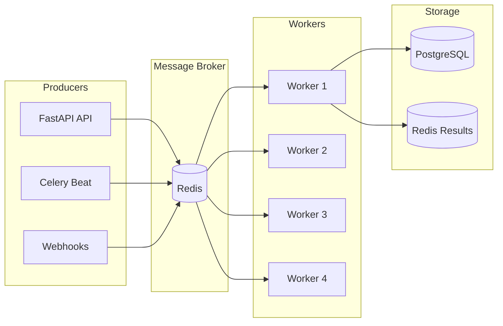

# Background Jobs & Queues

## Overview

Stratum AI uses Celery with Redis for background task processing.

---

## Architecture



---

## Configuration

### Celery App

```python
# app/workers/celery_app.py

celery_app = Celery(
    "stratum_ai",
    broker=settings.celery_broker_url,      # redis://localhost:6379/1
    backend=settings.celery_result_backend,  # redis://localhost:6379/2
    include=["app.workers.tasks"],
)

celery_app.conf.update(
    # Serialization
    task_serializer="json",
    accept_content=["json"],
    result_serializer="json",
    timezone="UTC",

    # Reliability
    task_acks_late=True,
    task_reject_on_worker_lost=True,
    task_track_started=True,

    # Retries
    task_default_retry_delay=60,
    task_max_retries=3,

    # Workers
    worker_prefetch_multiplier=1,
    worker_concurrency=4,

    # Results
    result_expires=86400,  # 24 hours

    # Time limits
    task_time_limit=600,       # 10 min hard limit
    task_soft_time_limit=540,  # 9 min soft limit
)
```

### Queue Configuration

| Queue | Purpose | Priority |
|-------|---------|----------|
| `default` | General tasks | Normal |
| `sync` | Data synchronization | High |
| `rules` | Rule evaluation | High |
| `intel` | Competitor intelligence | Low |
| `ml` | ML predictions | Normal |
| `cdp` | CDP segment computation | Normal |

### Task Routing

```python
task_routes = {
    "app.workers.tasks.sync_campaign_data": {"queue": "sync"},
    "app.workers.tasks.evaluate_rules": {"queue": "rules"},
    "app.workers.tasks.fetch_competitor_data": {"queue": "intel"},
    "app.workers.tasks.generate_forecast": {"queue": "ml"},
    "app.workers.tasks.compute_cdp_segment": {"queue": "cdp"},
}
```

---

## Scheduled Tasks (Beat Schedule)

| Task | Schedule | Queue | Description |
|------|----------|-------|-------------|
| `evaluate_all_rules` | Every 15 min | rules | Evaluate automation rules |
| `sync_all_campaigns` | Hourly (0 min) | sync | Sync campaign data from platforms |
| `refresh_all_competitors` | Every 6 hours | intel | Refresh competitor data |
| `generate_daily_forecasts` | 6:00 AM UTC | ml | Generate ML forecasts |
| `calculate_fatigue_scores` | 3:00 AM UTC | default | Calculate creative fatigue |
| `process_audit_logs` | Every minute | default | Process audit log queue |
| `calculate_cost_allocation` | 2:00 AM UTC | default | Calculate cost allocation |
| `calculate_usage_rollup` | 1:00 AM UTC | default | Calculate usage metrics |
| `check_pipeline_health` | Every hour (30 min) | default | Check data pipeline health |
| `calculate_daily_scores` | 4:00 AM UTC | default | Calculate daily scores |
| `run_all_predictions` | Every 30 min | ml | Run ML predictions |
| `process_scheduled_whatsapp` | Every minute | default | Process WhatsApp queue |
| `compute_all_cdp_segments` | Hourly (0 min) | cdp | Compute CDP segments |
| `compute_all_cdp_funnels` | Every 2 hours | cdp | Compute CDP funnels |
| `publish_scheduled_cms_posts` | Every minute | default | Publish scheduled CMS posts |

---

## Task Definitions

### Basic Task

```python
@celery_app.task
def simple_task(arg1: str, arg2: int) -> dict:
    """A simple background task."""
    result = process_data(arg1, arg2)
    return {"status": "success", "result": result}
```

### Task with Retry

```python
@celery_app.task(
    bind=True,
    autoretry_for=(HTTPException,),
    retry_backoff=True,
    retry_backoff_max=600,
    retry_jitter=True,
    max_retries=3,
)
def retriable_task(self, url: str) -> dict:
    """Task with automatic retry on HTTP errors."""
    try:
        response = httpx.get(url)
        return response.json()
    except HTTPException as exc:
        logger.warning(f"Retry {self.request.retries}/{self.max_retries}")
        raise
```

### Idempotent Task

```python
@celery_app.task(
    acks_late=True,
    reject_on_worker_lost=True,
)
def idempotent_task(record_id: int) -> dict:
    """Task safe to retry (idempotent)."""
    # Check if already processed
    if is_already_processed(record_id):
        return {"status": "skipped", "reason": "already_processed"}

    # Process
    result = process_record(record_id)
    mark_as_processed(record_id)

    return {"status": "success", "result": result}
```

---

## Common Tasks

### Campaign Sync

```python
@celery_app.task
def sync_campaign_data(tenant_id: int, platform: str) -> dict:
    """Sync campaign data from ad platform."""
    # Fetch from platform API
    campaigns = fetch_from_platform(tenant_id, platform)

    # Update database
    updated = update_campaigns(tenant_id, campaigns)

    return {
        "tenant_id": tenant_id,
        "platform": platform,
        "campaigns_updated": updated,
    }
```

### Rule Evaluation

```python
@celery_app.task
def evaluate_rules(tenant_id: int) -> dict:
    """Evaluate all active rules for a tenant."""
    rules = get_active_rules(tenant_id)
    results = []

    for rule in rules:
        # Check conditions
        if evaluate_conditions(rule):
            # Execute actions
            execute_actions(rule)
            results.append({"rule_id": rule.id, "triggered": True})
        else:
            results.append({"rule_id": rule.id, "triggered": False})

    return {"tenant_id": tenant_id, "results": results}
```

### CDP Segment Computation

```python
@celery_app.task
def compute_cdp_segment(segment_id: int) -> dict:
    """Compute profiles matching a segment."""
    segment = get_segment(segment_id)

    # Find matching profiles
    profile_ids = find_matching_profiles(segment.conditions)

    # Update segment membership
    update_segment_membership(segment_id, profile_ids)

    # Update count
    segment.profile_count = len(profile_ids)
    segment.last_computed_at = datetime.utcnow()

    return {
        "segment_id": segment_id,
        "profile_count": len(profile_ids),
    }
```

---

## Calling Tasks

### Synchronous Call (Blocking)

```python
# Wait for result (NOT recommended in web requests)
result = sync_campaign_data.delay(tenant_id=1, platform="meta")
value = result.get(timeout=30)
```

### Asynchronous Call (Non-blocking)

```python
# Fire and forget
sync_campaign_data.delay(tenant_id=1, platform="meta")

# Or with explicit apply_async
sync_campaign_data.apply_async(
    args=[1, "meta"],
    countdown=60,  # Delay 60 seconds
)
```

### Task Chaining

```python
from celery import chain

# Execute tasks in sequence
workflow = chain(
    sync_campaign_data.s(1, "meta"),
    evaluate_rules.s(1),
)
workflow.delay()
```

### Task Groups (Parallel)

```python
from celery import group

# Execute tasks in parallel
workflow = group(
    sync_campaign_data.s(1, "meta"),
    sync_campaign_data.s(1, "google"),
    sync_campaign_data.s(1, "tiktok"),
)
result = workflow.delay()
```

---

## Monitoring

### Flower Dashboard

Access at `http://localhost:5555`

Features:
- Active tasks
- Task history
- Worker status
- Queue depths
- Real-time graphs

### Celery Commands

```bash
# Check worker status
celery -A app.workers.celery_app inspect ping

# List active tasks
celery -A app.workers.celery_app inspect active

# List reserved tasks
celery -A app.workers.celery_app inspect reserved

# List registered tasks
celery -A app.workers.celery_app inspect registered

# Purge all tasks (dangerous!)
celery -A app.workers.celery_app purge
```

### Task Status Check

```python
from celery.result import AsyncResult

# Get task status
result = AsyncResult(task_id)

print(result.state)    # PENDING, STARTED, SUCCESS, FAILURE
print(result.result)   # Return value or exception
print(result.ready())  # True if finished
```

---

## Error Handling

### Task Failure

```python
@celery_app.task(bind=True)
def task_with_error_handling(self, data: dict):
    try:
        process(data)
    except ValidationError as e:
        # Don't retry validation errors
        logger.error(f"Validation error: {e}")
        return {"status": "error", "message": str(e)}
    except NetworkError as e:
        # Retry network errors
        self.retry(exc=e, countdown=60)
    except Exception as e:
        # Log and re-raise for visibility
        logger.exception("Unexpected error")
        raise
```

### Dead Letter Queue

Failed tasks after max retries can be sent to a dead letter queue:

```python
@celery_app.task(
    bind=True,
    max_retries=3,
    on_failure=on_task_failure,
)
def task_with_dlq(self, data: dict):
    ...

def on_task_failure(self, exc, task_id, args, kwargs, einfo):
    """Called when task fails permanently."""
    # Send to dead letter queue for manual inspection
    send_to_dlq(task_id, exc, args, kwargs)
```

---

## Best Practices

### 1. Keep Tasks Small

```python
# Bad: One large task
@celery_app.task
def process_all_tenants():
    for tenant in get_all_tenants():
        sync_data(tenant)
        evaluate_rules(tenant)
        send_reports(tenant)

# Good: Small, composable tasks
@celery_app.task
def process_tenant(tenant_id: int):
    chain(
        sync_data.s(tenant_id),
        evaluate_rules.s(tenant_id),
        send_reports.s(tenant_id),
    ).delay()
```

### 2. Make Tasks Idempotent

```python
@celery_app.task
def process_order(order_id: int):
    # Check if already processed
    if Order.query.get(order_id).processed:
        return {"status": "skipped"}

    # Process with lock
    with advisory_lock(f"order_{order_id}"):
        process_order_logic(order_id)
```

### 3. Pass IDs, Not Objects

```python
# Bad: Serialization issues
@celery_app.task
def process(campaign: Campaign):
    ...

# Good: Pass ID, fetch in task
@celery_app.task
def process(campaign_id: int):
    campaign = Campaign.query.get(campaign_id)
    ...
```

### 4. Set Time Limits

```python
@celery_app.task(
    time_limit=300,       # Hard limit: 5 minutes
    soft_time_limit=270,  # Soft limit: 4.5 minutes
)
def time_limited_task():
    try:
        long_operation()
    except SoftTimeLimitExceeded:
        # Clean up and return partial result
        return {"status": "partial"}
```

---

## Running Workers

### Development

```bash
# Single worker
celery -A app.workers.celery_app worker --loglevel=info

# With specific queues
celery -A app.workers.celery_app worker -Q sync,rules --loglevel=info

# Scheduler
celery -A app.workers.celery_app beat --loglevel=info

# Flower
celery -A app.workers.celery_app flower --port=5555
```

### Production (Docker)

```yaml
# docker-compose.yml
worker:
  command: celery -A app.workers.celery_app worker --loglevel=info --concurrency=4

scheduler:
  command: celery -A app.workers.celery_app beat --loglevel=info
```
