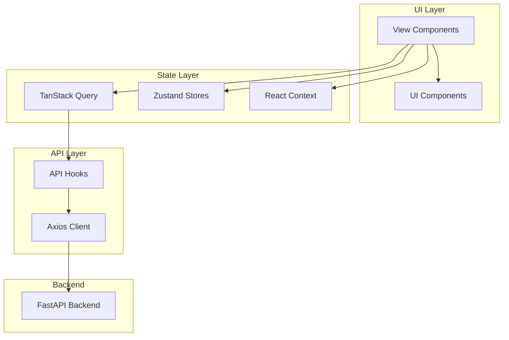

# Frontend Overview

## Technology Stack

| Technology | Version | Purpose |
|------------|---------|---------|
| React | 18.x | UI framework |
| TypeScript | 5.x | Type safety |
| Vite | 5.x | Build tool & dev server |
| Tailwind CSS | 3.x | Utility-first styling |
| TanStack Query | 5.x | Server state management |
| Zustand | 4.x | Global state management |
| React Router | 6.x | Client-side routing |
| React Hook Form | 7.x | Form management |
| Zod | 3.x | Schema validation |
| Recharts | 3.x | Charts & visualizations |
| Framer Motion | 11.x | Animations |
| i18next | 25.x | Internationalization |

---

## Project Structure

```
frontend/
├── src/
│   ├── App.tsx                 # Root component with routing
│   ├── main.tsx                # Application entry point
│   │
│   ├── api/                    # API layer (30+ files)
│   │   ├── auth.ts             # Authentication hooks
│   │   ├── campaigns.ts        # Campaign management
│   │   ├── cdp.ts              # CDP operations (60+ hooks)
│   │   └── ...
│   │
│   ├── components/             # Reusable components
│   │   ├── ui/                 # Base UI components (shadcn/ui)
│   │   │   ├── button.tsx
│   │   │   ├── dialog.tsx
│   │   │   └── ...
│   │   ├── common/             # Shared components
│   │   │   ├── LoadingSpinner.tsx
│   │   │   └── ErrorBoundary.tsx
│   │   ├── cdp/                # CDP-specific components
│   │   ├── charts/             # Chart components
│   │   └── auth/               # Auth-related components
│   │
│   ├── views/                  # Page components
│   │   ├── dashboard/          # Dashboard views
│   │   ├── cdp/                # CDP views
│   │   ├── tenant/             # Tenant-scoped views
│   │   ├── superadmin/         # Admin views
│   │   ├── pages/              # Public pages
│   │   └── ...
│   │
│   ├── contexts/               # React contexts
│   │   ├── AuthContext.tsx     # Authentication state
│   │   ├── ThemeContext.tsx    # Theme management
│   │   ├── DemoContext.tsx     # Demo mode
│   │   └── TierContext.tsx     # Subscription tier
│   │
│   ├── stores/                 # Zustand stores
│   │   ├── tenantStore.ts      # Tenant state
│   │   └── featureFlagsStore.ts
│   │
│   ├── hooks/                  # Custom hooks
│   │   ├── useAuth.ts
│   │   ├── useToast.ts
│   │   └── ...
│   │
│   ├── lib/                    # Utilities
│   │   ├── utils.ts            # Helper functions
│   │   └── cn.ts               # Class name merger
│   │
│   └── locales/                # i18n translations
│       ├── en/
│       └── ar/
│
├── public/                     # Static assets
├── index.html                  # HTML template
├── vite.config.ts              # Vite configuration
├── tailwind.config.js          # Tailwind configuration
├── tsconfig.json               # TypeScript configuration
└── package.json                # Dependencies
```

---

## Architecture Patterns

### Provider Hierarchy

```tsx
<HelmetProvider>
  <ThemeProvider>
    <AuthProvider>
      <DemoProvider>
        <TooltipProvider>
          <JoyrideProvider>
            <App />
          </JoyrideProvider>
        </TooltipProvider>
      </DemoProvider>
    </AuthProvider>
  </ThemeProvider>
</HelmetProvider>
```

### Data Flow



---

## Key Dependencies

### UI Components

```json
{
  "@radix-ui/react-*": "Various Radix primitives",
  "@headlessui/react": "Headless UI components",
  "@heroicons/react": "Icon library",
  "lucide-react": "Additional icons",
  "@tremor/react": "Dashboard charts",
  "recharts": "Custom charts",
  "framer-motion": "Animations"
}
```

### Data Management

```json
{
  "@tanstack/react-query": "Server state caching",
  "zustand": "Client state management",
  "axios": "HTTP client",
  "zod": "Schema validation",
  "react-hook-form": "Form management"
}
```

### Styling

```json
{
  "tailwindcss": "Utility CSS",
  "tailwindcss-animate": "Animation utilities",
  "tailwindcss-rtl": "RTL support",
  "class-variance-authority": "Component variants",
  "clsx": "Conditional classes",
  "tailwind-merge": "Class merging"
}
```

---

## Development Workflow

### Starting Development Server

```bash
cd frontend
npm install
npm run dev
```

### Environment Variables

```env
# .env
VITE_API_BASE_URL=http://localhost:8000
VITE_WS_URL=ws://localhost:8000
VITE_DEFAULT_LOCALE=en
VITE_SENTRY_DSN=
```

### Building for Production

```bash
npm run build
npm run preview  # Preview production build
```

---

## Code Organization Principles

### 1. Colocation

Related code is kept together:

```
views/cdp/
├── CDPDashboard.tsx      # View component
├── CDPDashboard.test.tsx # Tests
└── components/           # View-specific components
```

### 2. Barrel Exports

Index files for clean imports:

```tsx
// components/ui/index.ts
export { Button } from './button'
export { Dialog } from './dialog'
export { Input } from './input'

// Usage
import { Button, Dialog, Input } from '@/components/ui'
```

### 3. Path Aliases

Configured in `tsconfig.json`:

```json
{
  "compilerOptions": {
    "baseUrl": ".",
    "paths": {
      "@/*": ["./src/*"]
    }
  }
}
```

Usage:
```tsx
import { Button } from '@/components/ui/button'
import { useAuth } from '@/hooks/useAuth'
```

---

## Feature Flags

Features can be toggled via the `featureFlagsStore`:

```tsx
import { useFeatureFlags } from '@/stores/featureFlagsStore'

function FeatureComponent() {
  const { flags } = useFeatureFlags()

  if (!flags.cdp_enabled) {
    return null
  }

  return <CDPDashboard />
}
```

---

## Error Boundaries

Components are wrapped with error boundaries for graceful error handling:

```tsx
import { ErrorBoundary } from '@/components/common/ErrorBoundary'

function App() {
  return (
    <ErrorBoundary fallback={<ErrorPage />}>
      <Dashboard />
    </ErrorBoundary>
  )
}
```

---

## Performance Optimizations

### Code Splitting

Views are lazy-loaded:

```tsx
const CDPDashboard = lazy(() => import('./views/cdp/CDPDashboard'))
```

### Suspense Boundaries

```tsx
<Suspense fallback={<LoadingSpinner />}>
  <CDPDashboard />
</Suspense>
```

### Query Caching

TanStack Query caches API responses:

```tsx
const { data } = useQuery({
  queryKey: ['campaigns'],
  queryFn: fetchCampaigns,
  staleTime: 5 * 60 * 1000, // 5 minutes
})
```
